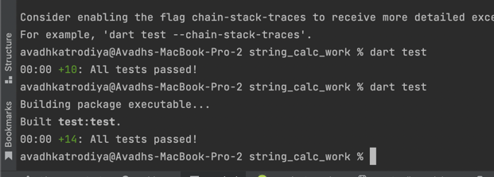

# String Calculator TDD Kata

[](https://dart.dev/)
[](https://flutter.dev)
[](https://en.wikipedia.org/wiki/Test-driven_development)
[](https://github.com/avadhworkzone/string_calc)
[](https://github.com/avadhworkzone/string_calc)

A Dart implementation of the String Calculator Kata demonstrating strict Test-Driven Development (TDD) methodology. This project was built as part of the Incubyte TDD Assessment.

## Topics
`dart` `tdd` `test-driven-development` `kata` `string-calculator` `unit-testing` `clean-code` `incubyte` `red-green-refactor`

## Project Overview

This project implements a String Calculator that adds numbers from a string input. The implementation follows the Red-Green-Refactor TDD cycle, where each feature is developed incrementally:

| Phase | Description |
|-------|-------------|
| **RED** | Write a failing test first |
| **GREEN** | Write minimal code to make the test pass |
| **REFACTOR** | Clean up the code while keeping tests green |

## Why TDD?

- **Confidence**: Every line of code is covered by tests
- **Design**: Tests drive better API design  
- **Documentation**: Tests serve as living documentation
- **Maintainability**: Refactoring is safe with comprehensive test coverage

## Features Implemented

| # | Feature | Description | Example |
|---|---------|-------------|---------|
| 1 | Empty String | Returns 0 for empty input | `add("")` → 0 |
| 2 | Single Number | Returns the number itself | `add("1")` → 1 |
| 3 | Two Numbers | Sum of comma-separated numbers | `add("1,2")` → 3 |
| 4 | Multiple Numbers | Handles any amount of numbers | `add("1,2,3,4,5")` → 15 |
| 5 | Newline Delimiter | Supports `\n` as delimiter | `add("1\n2,3")` → 6 |
| 6 | Custom Delimiter | Supports `//[delimiter]\n` syntax | `add("//;\n1;2")` → 3 |
| 7 | Negative Numbers | Throws exception listing all negatives | `add("-1,2,-3")` → Exception |
| 8 | Ignore > 1000 | Numbers greater than 1000 ignored | `add("2,1001")` → 2 |
| 9 | Multi-char Delimiter | Supports `//[***]\n` syntax | `add("//[***]\n1***2")` → 3 |
| 10 | Multiple Delimiters | Supports `//[*][%]\n` syntax | `add("//[*][%]\n1*2%3")` → 6 |
| 11 | Input Validation | Handles empty parts gracefully | `add("1,,3")` → 4 |
| 12 | Whitespace Handling | Trims whitespace from numbers | `add(" 1 , 2 ")` → 3 |

## Screenshots

### Test Execution


*Complete TDD journey with 20+ screenshots available in `/screenshots` folder*

## Usage Examples

```dart
import 'package:string_calc/string_calculator.dart';

void main() {
  final calc = StringCalculator();

  // Basic usage
  print(calc.add(''));           // 0
  print(calc.add('1'));          // 1
  print(calc.add('1,2'));        // 3
  print(calc.add('1,2,3,4,5'));  // 15

  // Newline delimiter
  print(calc.add('1\\n2,3'));     // 6

  // Custom delimiter
  print(calc.add('//;\\n1;2'));   // 3

  // Ignore numbers > 1000
  print(calc.add('2,1001'));     // 2

  // Multiple delimiters
  print(calc.add('//[*][%]\\n1*2%3'));     // 6

  // Input validation - empty parts ignored
  print(calc.add('1,,3'));       // 4
  print(calc.add(',1,2,'));      // 3

  // Whitespace handling
  print(calc.add(' 1 , 2 '));    // 3

  // Negative numbers throw exception
  try {
    calc.add('-1,2,-3');
  } catch (e) {
    print(e);  // Exception: negative numbers not allowed -1,-3
  }
}
```

## Project Structure

```
string_calc/
├── lib/
│   └── string_calculator.dart      # Main implementation (52 lines)
├── test/
│   └── string_calculator_test.dart # Unit tests (14 tests)
├── screenshots/
│   ├── step1_red_empty_string.png  # TDD Step 1 RED
│   ├── step1_green_empty_string.png # TDD Step 1 GREEN
│   ├── ...                         # 20+ TDD process screenshots
│   ├── final_all_tests_pass.png    # Final test results
│   └── commit_history_tdd.png      # Git commit history
├── pubspec.yaml                    # Dependencies
├── .gitignore                      # Git ignore rules
└── README.md                       # Documentation
```

## Running Tests

```bash
# Run all tests
dart test

# Run tests with verbose output
dart test --reporter expanded

# Run specific test file
dart test test/string_calculator_test.dart
```

## Test Results

```
✓ returns 0 for empty string
✓ returns the number for single number
✓ returns sum for two comma-separated numbers
✓ handles multiple numbers
✓ handles newline as delimiter
✓ supports custom single-char delimiter
✓ throws exception for negative numbers
✓ shows all negative numbers in exception message
✓ ignores numbers greater than 1000
✓ supports multi-character delimiter
✓ supports multiple delimiters
✓ supports multiple multi-character delimiters
✓ throws exception for invalid input
✓ ignores empty parts between delimiters

All 14 tests passed!
```

## TDD Commit History

Each feature follows the RED-GREEN-REFACTOR pattern. View the complete commit history:

```bash
git log --oneline
```

**Sample Commits:**
```
f709c40 GREEN: Complete multi-character delimiters - ALL REQUIREMENTS IMPLEMENTED!
c36d1e3 RED: Add failing test for multi-character delimiters
9607588 GREEN: Make ignore numbers > 1000 test pass - only add numbers <= 1000
0f54378 RED: Add failing test for ignoring numbers greater than 1000
2a774bf GREEN: Make negative numbers test pass - validate and throw exception
0b4fc65 RED: Add failing test for negative numbers exception
31db023 GREEN: Make custom delimiters test pass - parse //delimiter\\n format
ac091ac RED: Add failing test for custom delimiters
...
```

**Total: 23 commits demonstrating incremental TDD development.**

## TDD Process Documentation

This project includes complete visual documentation of the TDD process:

- **20+ Screenshots** showing each RED-GREEN cycle
- **Commit History** with proper TDD discipline
- **Process Transparency** - every step documented
- **Learning Resource** - perfect example of TDD methodology

### TDD Steps Documented:

1. **Step 1**: Empty String Returns 0 (RED → GREEN)
2. **Step 2**: Single Number Returns Itself (RED → GREEN)  
3. **Step 3**: Two Numbers Return Sum (RED → GREEN)
4. **Step 4**: Multiple Numbers Return Sum (RED → GREEN)
5. **Step 5**: Newlines Work as Delimiters (RED → GREEN)
6. **Step 6**: Custom Delimiters Work (RED → GREEN)
7. **Step 7**: Negative Numbers Throw Exception (RED → GREEN)
8. **Step 8**: Multiple Negative Numbers in Exception (GREEN - Already works!)
9. **Step 9**: Numbers Greater Than 1000 Are Ignored (RED → GREEN)
10. **Step 10**: Multi-character Delimiters Work (RED → GREEN)

## Requirements

- **Dart SDK**: ^3.10.4
- **Flutter**: 3.38.5+
- **Dependencies**: test ^1.21.0

## Getting Started

```bash
# Clone the repository
git clone https://github.com/avadhworkzone/string_calc.git

# Navigate to project
cd string_calc

# Get dependencies
dart pub get

# Run tests
dart test
```

## Key Learnings

- **TDD Discipline**: Each feature built with failing test first
- **Incremental Development**: Small steps, continuous validation
- **Clean Code**: Refactoring with test safety net
- **Edge Case Handling**: Comprehensive input validation
- **Exception Design**: Clear error messages for invalid input

## Author

**Avadh Katrodiya**
- GitHub: [@avadhworkzone](https://github.com/avadhworkzone)

## License

This project is open source and available under the MIT License.

---

*This implementation demonstrates professional TDD practices with complete process documentation, making it an excellent learning resource for Test-Driven Development methodology.*