# String Calculator TDD Kata

TDD implementation of String Calculator following RED-GREEN-REFACTOR cycles.

## Requirements
- Empty string returns 0
- Single number returns itself  
- Multiple comma-separated numbers return sum
- Handle newlines as delimiters
- Support custom delimiters
- Throw exception for negative numbers
- Ignore numbers > 1000
- Support multi-character delimiters

## TDD Process

### Step 1: Empty String Returns 0
**RED**: 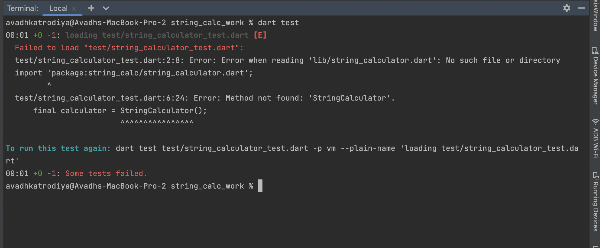
**GREEN**: 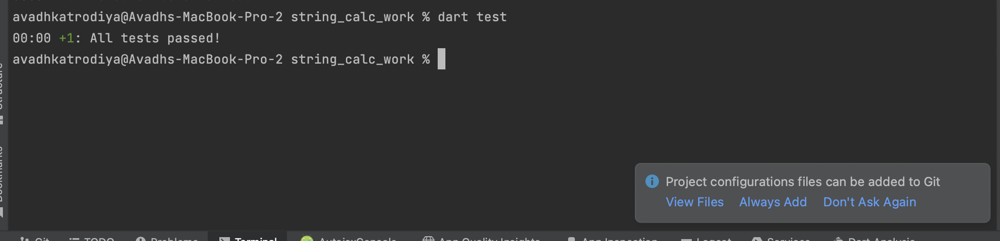

### Step 2: Single Number Returns Itself
**RED**: 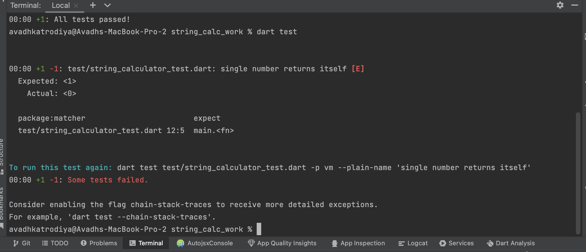
**GREEN**: 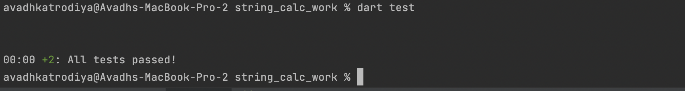

### Step 3: Two Numbers Return Sum
**RED**: 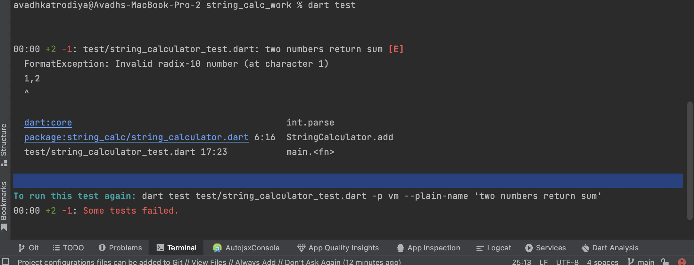
**GREEN**: 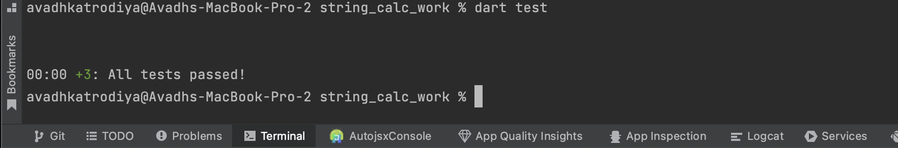

### Step 4: Multiple Numbers Return Sum
**RED**: 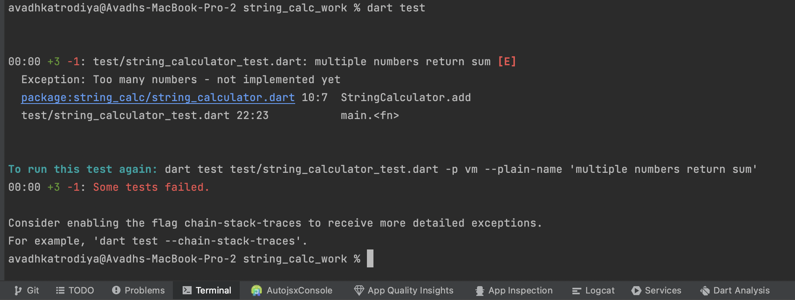
**GREEN**: 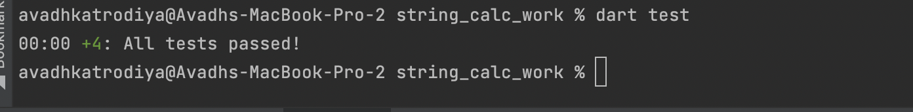

### Step 5: Newlines Work as Delimiters
**RED**: 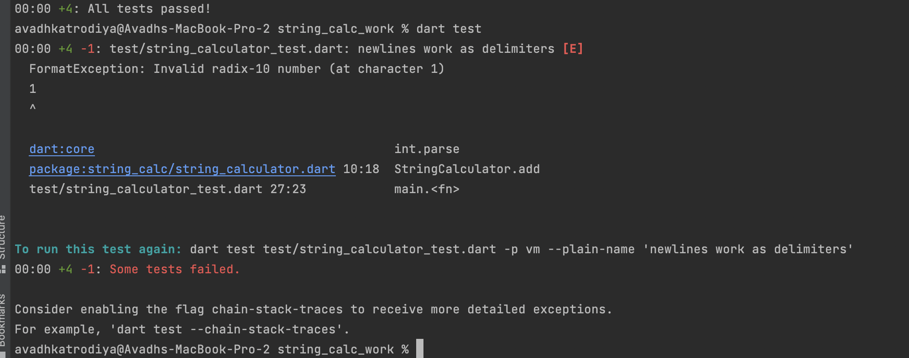
**GREEN**: 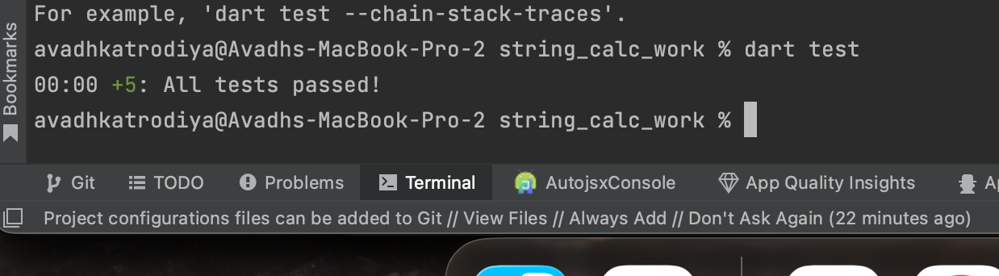

### Step 6: Custom Delimiters Work
**RED**: 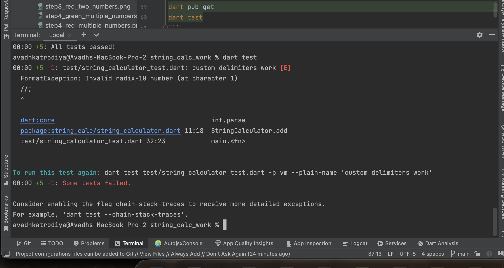

## Run Tests
```bash
dart pub get
dart test
```